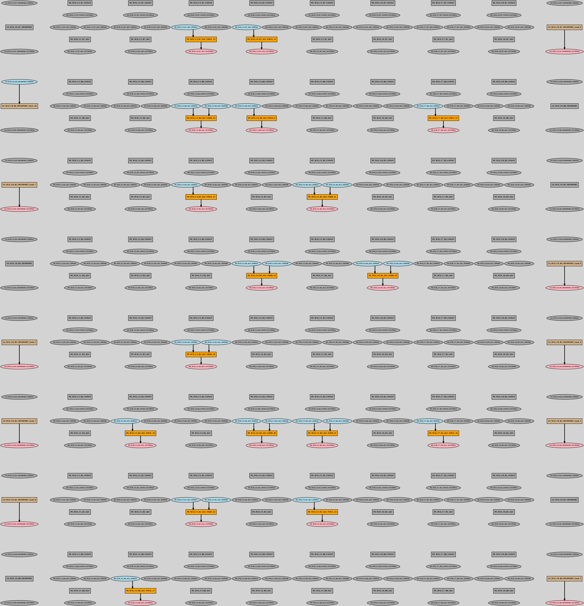
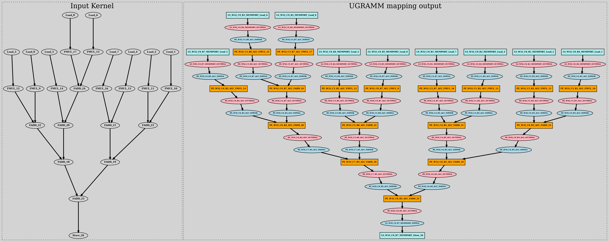

## UGRAMM

- GRAph Minor Mapper (GRAMM) is a novel technique which uses Graph Minor method for CGRA Mapping which significantly speed up the Mapping process. 
- More details could be find in this publication: [here](https://ieeexplore.ieee.org/document/10296406)
- This repository contains a more general version of GRAMM known as UGRAMM (Universal GRAph Minor Mapper), which can not only be used in CGRA mapping but as well could be easily incorporated in any other applications such as ASIC/FPGA packing, etc.
- If referred, kindly cite the research using:
``` 
G. Zhou, M. Stojilović and J. H. Anderson, "GRAMM: Fast CGRA Application Mapping Based on A Heuristic for Finding Graph Minors," 2023 33rd International Conference on Field-Programmable Logic and Applications (FPL), Gothenburg, Sweden, 2023, pp. 305-310, doi: 10.1109/FPL60245.2023.00052.
```

## Helper Script usage:


The following command maps the input DFG on the RIKEN architecture:

> ./run_ugramm.sh 15 8 8 Kernels/Conv_Balance/conv_nounroll_Balance.dot config.json

- run_ugramm.sh script:
    - Arugment info:
        - $1 [Seed] = 0,1,15 etc...
        - $2 [NR] = 8
        - $3 [NC] = 8
        - $4 [ApplicationGraph] = Kernels/Conv_Balance/conv_nounroll_Balance.dot 
        - $5 [grammConfigFile]  = config.json example
    - Generating device model using external script
        - `cd scripts && ./device_model_gen.py -NR $2 -NC $3 -Arch RIKEN && cd ..`
    - Executes UGRAMM and produces mapping result in mapping_output.dot
        - `make && ./UGRAMM --seed $1 --verbose_level 0 --dfile $device_model_output --afile $4 --config $5`
    - Finally converts the mapped output dot file into png
        - `neato -Tpng positioned_dot_output.dot -o positioned_dot_output.png`
        - `dot -Tpng unpositioned_dot_output.dot -o unpositioned_dot_output.png`
    - Successful mapping result will be in `unpositioned_dot_output.png` and `positioned_dot_output.png`

## Positioned graph output:



## Unpositioned graph output:




