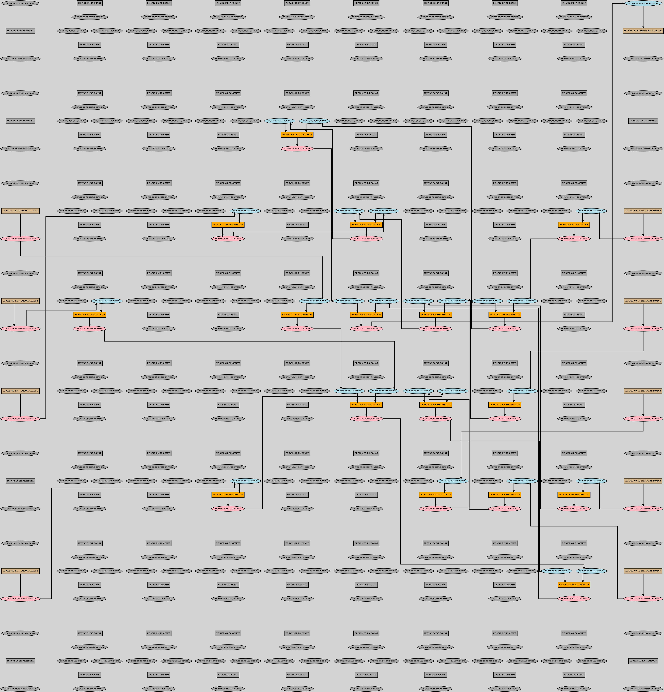
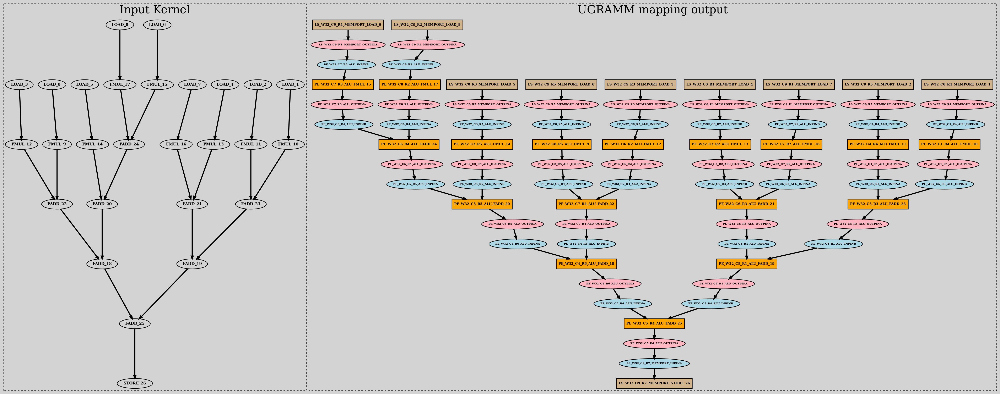

## GRAMM

- GRAph Minor Mapper (GRAMM) is an novel technique which uses Graph Minor method for CGRA Mapping which significantly speed up the Mapping process. 
- More details could be find in this publication: [here](https://ieeexplore.ieee.org/document/10296406)
- If referred, kindly cite the research using:
``` 
G. Zhou, M. Stojilović and J. H. Anderson, "GRAMM: Fast CGRA Application Mapping Based on A Heuristic for Finding Graph Minors," 2023 33rd International Conference on Field-Programmable Logic and Applications (FPL), Gothenburg, Sweden, 2023, pp. 305-310, doi: 10.1109/FPL60245.2023.00052.
```


## Helper Script usage:


The following command maps the input DFG on the RIKEN architecture:

> ./run_gramm.sh Kernels_Modified/Conv_Balance/conv_nounroll_Balance.dot  8 8 RIKEN

- run_gramm.sh script:
    - Arugment info:
        - $1 [Kernel]: Kernels/Conv_Balance/conv_nounroll_Balance.dot 
        - $2 [NR] = 8
        - $3 [NC] = 8
        - 4 [Arch_Type for device model] =  RIKEN
    - Generating device model using external script
        - `cd scripts && ./device_model_gen.py -NR $2 -NC $3 -Arch RIKEN && cd ..`
    - Executes GRAMM and produces mapping result in mapping_output.dot
        - `make && ./GRAMM $1 $device_model_output $2 $3 0`
    - Finally converts the mapped output dot file into png
        - `neato -Tpng mapping_output.dot -o mapping_output.png`
    - Successful mapping result will be in `mapping_output.png`

## Positioned graph output:



## Unpositioned graph output:




